## Muertes En Exceso Encima Del Promedio (corte 10/08/2020)

### Desde Marzo 16

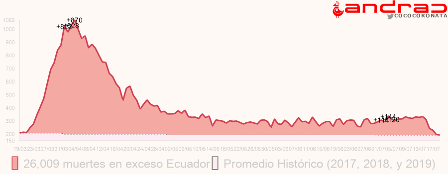

### Desde Mayo

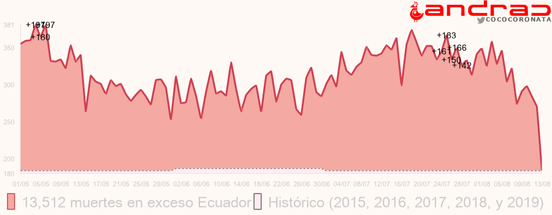

## Pichincha

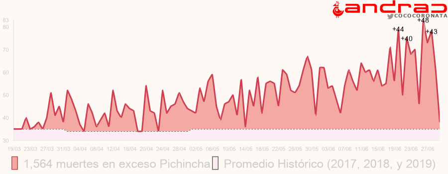

## Guayas

### Desde Marzo 16

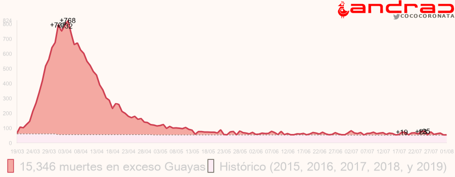

### Desde Mayo

## Chimborazo

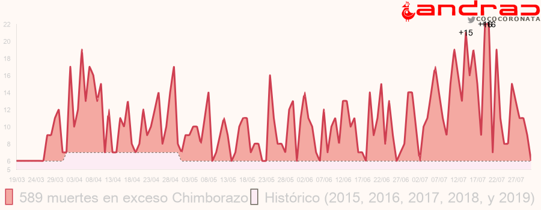

## Imbabura

## Azuay

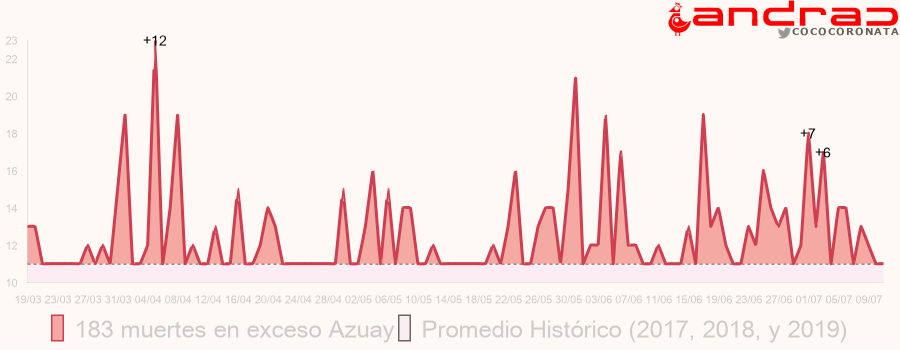

## Sucumbíos

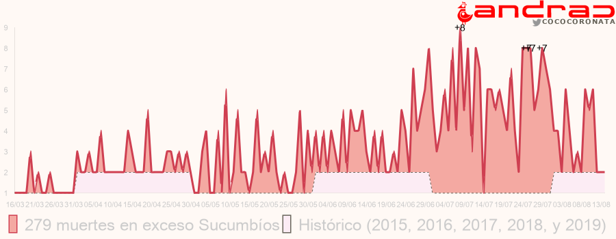

## Manabí

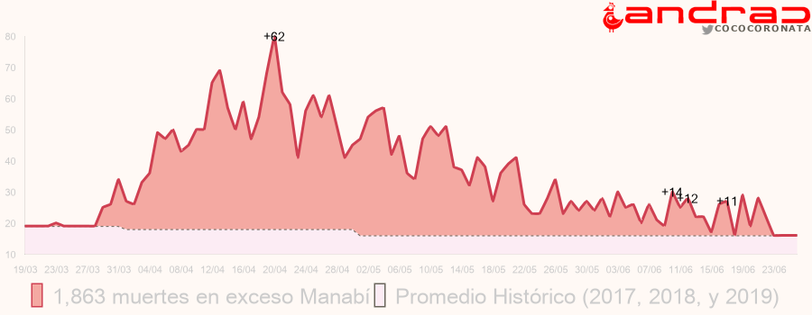

## El Oro

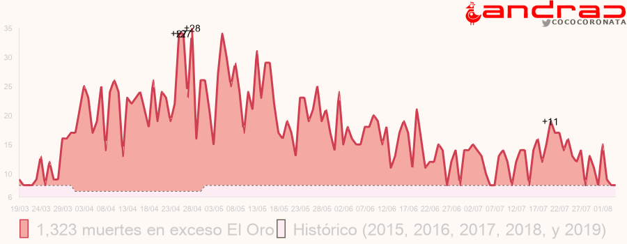

## Los Ríos

## Cotopaxi

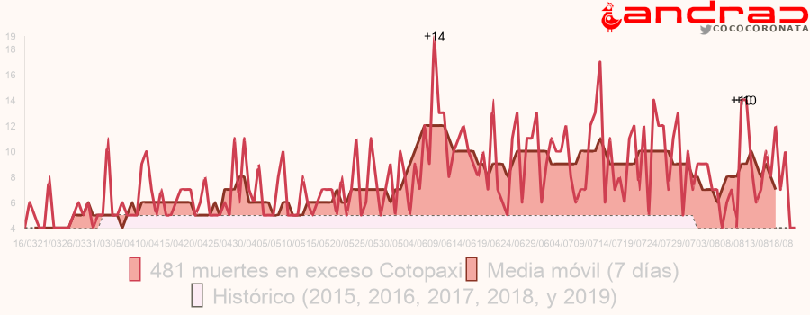

## Tungurahua

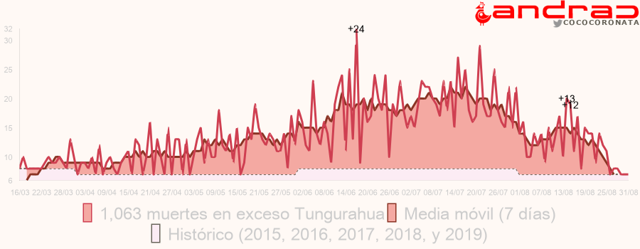

## Santo Domingo Tsáchilas

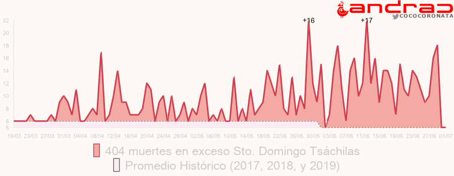

## Esmeraldas

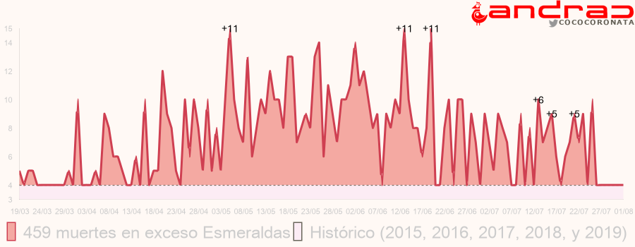

## Santa Elena

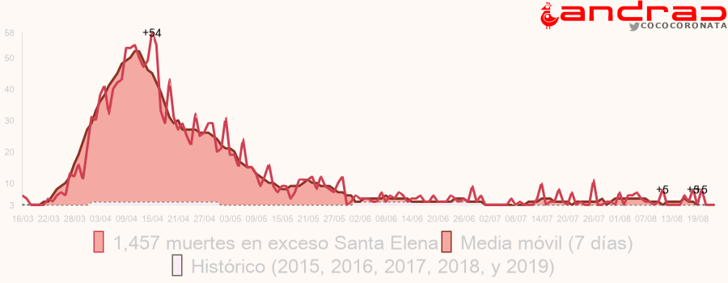
